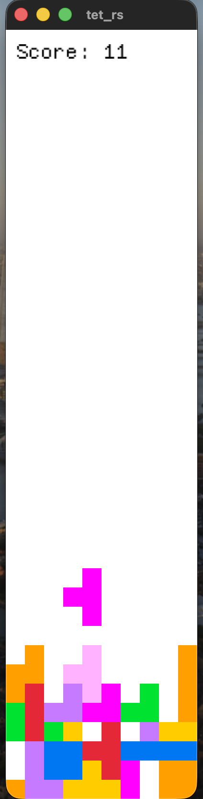

# tet_rs

A Tetris clone written in Rust using [macroquad](https://github.com/not-fl3/macroquad).



## Controls

- **Left/Right arrows** - move piece
- **Down arrow** (hold) - soft drop
- **Up arrow** - hard drop
- **Space** - rotate
- **G** - toggle ghost piece
- **R** - restart (on game over)

## Build & Run

```
cargo run
```
